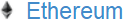

# Donations

If you find the **Moolah** module useful and would like to show your gratitude by donating, here are some donation options.

Donate | Description | Address
------ | ----------- | -------
**BTC** |  | 12YvJdkuFarTLqeaomPCXxBW9xEXd88m6K
**BTH** |  | 1At8tpGDVXp1uXQD11RRrQt7PtFwj1bhfN
**ETH** |  | 0xde9ab3188E485D77c45a925Fe4F7c7a8Bfc1D647
**LTC** |  | LMumQYvevWqxi7Zr4cvZMf7NjgM6bX62CC
**[PayPal](https://www.paypal.me/CraigDayton)** | $USD fiat currency

***
The **Moolah** module would not have been possible without the following open sourced software projects. A percentage of any donation
received will be redirected to each of these opened sourced projects. If you are consistently using any of these software components
individually, you may wish to donate directly to them too.

**[VeraCrypt](https://www.veracrypt.fr/en/Donation.html)**

**[PasswordSafe](https://pwsafe.org/)**

**[TortoiseSVN](https://tortoisesvn.net/donate.html)**

**[GnuCash](http://gnucash.org/donate.phtml)**
***
