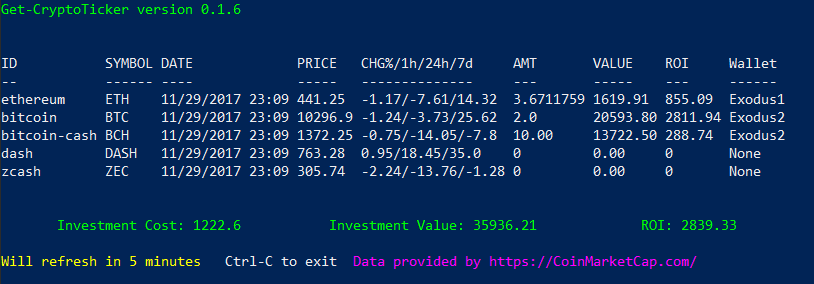

# Get-CryptoTicker Cmdlet

The **Get-CryptoTicker** displays the price of the current assests and the return on investment for each asset every 5 minutes.

The public RESTAPI from [CoinMarketCap](https://CoinMarketCap.com) is used to get the current asset price.

The list of assets displayed is determined by the records in the XML database file, **AssetDB.xml** found in the Moolah VeraCrypt
container mounted on drive A by default. All **Buy** and **Exchange** record types with a asset cost greater than or equal to zero will be
displayed.

Update the AssetDB to accurately reflect your current asset holdings from your Exodus application. An example of the record structure in the default **AssetDB** is as follows.

**Buy Record**

    <Trans Wallet="Exodus1" Exchange="Coinbase" Ticker="ETH" TRID="VUV2599" TRTYPE="Buy">
      <Name>ethereum</Name>            <- NAME OF CURRENTENCY AS IDENTIFED BY CoinMarketCap
      <Date>08/28/2014</Date>          <- BUY DATE
      <Amt>3.6711759</Amt>             <- AMOUNT OF CURRENTENCY AS SHOWN BY EXODUS WALLET
      <Unit>USD</Unit>                 <- BUY CURRENTECNY USED FOR PURCHASE
      <AssetCost>46.20</AssetCost>     <- COST OF AN ASSET COIN
      <Fee>29.80</Fee>                 <- EXCHANGE FEE CHARGED
      <Total>169.60</Total>            <- TOTAL AMOUNT OF USD FOR THE BUY
      <TXamt></TXamt>
      <TXfee></TXfee>
      <Memo></Memo>
    </Trans>

The **TRTYPE="Buy"** attribute sets the record type being defined.

The **Amt** tag field times the current asset value from CoinMarketCap is used to determine the current value of the asset.  The current value of the asset
and the **Total** tag field are used to determine the **return on investment** (ROI).

When the **Amt** tag field is 0, only the current value of the assest is calculated. This is useful for displaying the current value of a asset which is just
being monitored.

***

**Exchange Record**

The **Exchange Record** is used to record the exchange of one crypto asset for another and consists of the same fields as a buy record.  Use the **TXamt**, **TXfee**,
and **Memo** tags to record the cost details of the exchange.

If desired, a **Sell Record** can be created to record the details of a sold asset.

***

Start **Get-CryptoTicker** by clicking on the icon  or by entering

    PS> Get-CryptoTicker

in the PowerShell console window.

## Ticker History

Each 5 minute interval of data is captured in a history file called, **TickerHistory.csv**. This file can be located in the
directory, C:\user\\[username]\AppData\local.  A grid view of the asset history can be displayed by entering:

    PS> Get-CryptoTicker History

Filters can be set and sorted by any column.

## Get Help

To get help for the cmdlet, **Get-CryptoTicker** enter either of the commands below.

    PS> Get-Help Get-CryptoTicker

    PS> Get-Help Get-CryptoTicker -full