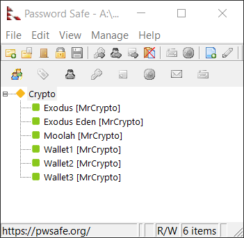
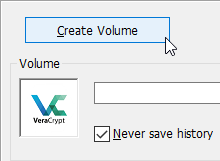
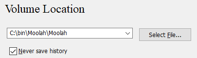
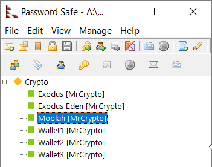
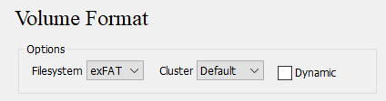
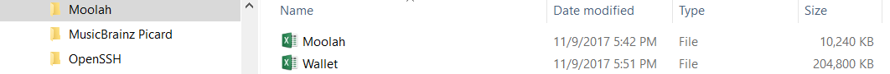

# Integration Setup

Now all of the integration software should be installed and functional on your computer along with installation of the **Moolah** PowerShell module.

## Create PasswordSafe accounts

Start the PasswordSafe application and setup accounts similiar to the ones image below.

Looking at the above image, you can see strong passwords (20+) characters have been setup for the wallet applications (Exodus & Eden), and for the VeraCrypt containers (Moolah, & Wallet1 - 3).

You are at complete liberty to use any naming convention that you desire.  Hopefully you have choosen a strong password that you can remember for the PasswordSafe application or have it on a hard copy somewhere.  **Losing or forgetting your PasswordSafe's password is effectively the same as losing all of your data**.

At a minimum you will to create 3 accounts, one for the **Moolah** and **wallet** VeraCrypt containers and one for the **wallet** application.  Create strong passwords (20+ characters) for each of those accounts.

Go to the install location of PasswordSafe and note the full name of the file ending with an extension of .psafe3.  For the sake of this setup example, I'm going to assume the name of the file is **Moolah.psafe3**.

## Create VeraCrypt containers

The **Moolah** VeraCrypt container will contain at a minimum the Moolah database file, **MoolahDB.xml** and the PasswordSafe database file, **Moolah.psafe3** (your file name can be anything you want it to be).

On the C: drive a folder needs to be created that servers as the Online container location.  For this setup example, I'm going to assume that **C:\bin\Moolah** is the folder location for the **Online** VeraCrypt container location.

Go ahead an create the desired **Online** folder on the C: drive.

The same folder location needs to be created on your Offline media (USB or MircoSD).  For this setup example, I'm going to a assume that
**D:\bin\Moolah** is the folder location for **Offline** VeraCrypt container location.

Go ahead an create the desired **Offline** folder on the D: drive.

Copy any small file on your computer to the **Online** folder location and rename it to **Moolah**.  Then make a second copy of this file and name it **Wallet** or a name of your choosing.  These two files will be overwritten by VeraCrypt during the container creation step.

Launch the VeraCrypt application and click on the **Create Volume** button to create the *Moolah* VeraCrypt container.

Accept all of the default choices on the Wizard dialogs and click **Next**

At the **Volume Location** dialog click on the *Select File* and select Moolah file in the **C:\bin\Moolan** folder. After clicking Next, you will get a warning dialong asking if it is ok to over write the file select, **Yes**.

At the **Volume Size** dialog, enter a size of **10MB** and click next.

At the **Volume Password** dialog, open PasswordSafe and copy the Moolan account password.

Right-click and select **Copy Password to Clipboard**

At the **Volume Password** dialog, type **CTRL-C** in each password field and click **Next**

At the **Volume Format** dialog following the instruction for moving the mouse to randomize
the encryption process, then select **exFat** as the FileSystem and then click **Format**.

You'll get a warning indicating the file will be overwritten, select **Yes**.

Awesome, now the **Moolan** container has been created.

Click **Next** to create the **Wallet** container.  The proccess for creating the **Wallet** container will be the same as for the **Moolan** container except you'll want to select a size of **200MB** for this container.  And I hope obviously you know you'll have to select a different seed file for the creation of the container.

Now at this point, there should be 2 empty VeraCrypt containers in the **Online** folder, **C:\bin\Moolah** or the folder naming or your choice.

Once the containers have valid data in them, **you'll want to be extremely careful to NEVER use them as seed files for creating new containers**. It should be very apparent that VeraCrypt will overwrite any file that you give it during the create volume process.

The **Online** folder should now have two VeraCrypt containers.

Next, the empty VeraCrypt containers need to be mounted so valid data can be copied to them.

Using VeraCrypt mount the **Moolah container** as drive **A** and the **Wallet container** as drive **B**.

Typically, the A and B drive letters are rarely used but if they are already in use select a different pair of drive letter that can be used consistently.

Copy your PasswordSafe database, **Moolan.psafe3** to drive A.

If you have crypto currency in your Exodus wallet, I recommend you copy the directory to a backup folder and create an empty wallet. Because you don't want to be in a situation where you've accidently move coinage to the wrong folder location. If you start **Exodus** the default way and see an empty wallet, it should be apparent you didn't launch **Exodus** using the **Moolah** module.

Copy the contents of your Exodus wallet data folder to drive B.  **Obviously, Exodus should not be running at this point in time**.

Dismount both the **A** and **B** drives using VeraCrypt.  Note that VeraCrypt has an icon in the system tray so you can interface with it that way too.

## Moolah Initialization

Next we need to initialize the **Moolah** module, so it knows where to find the Online and OffLine folder paths you've choosen and the desired drive letters and etc...

So make notes of this information because it will be needed in the last step of initializing **Moolah**.
