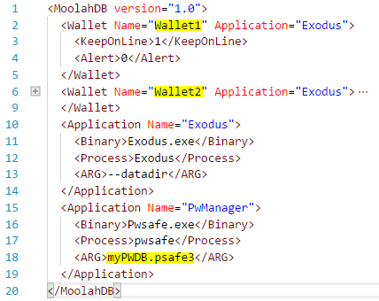
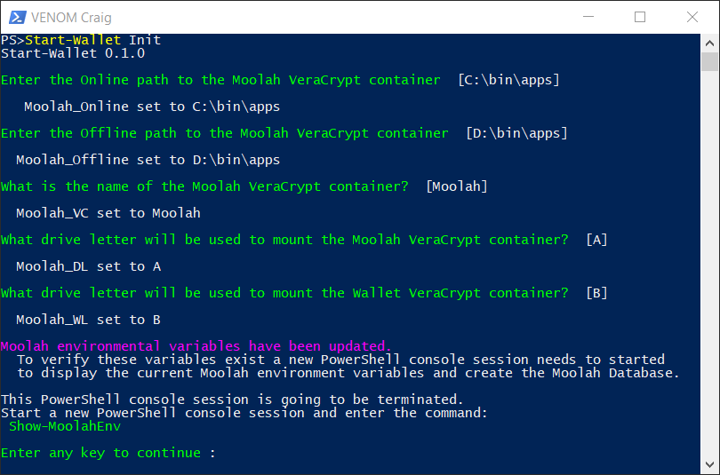
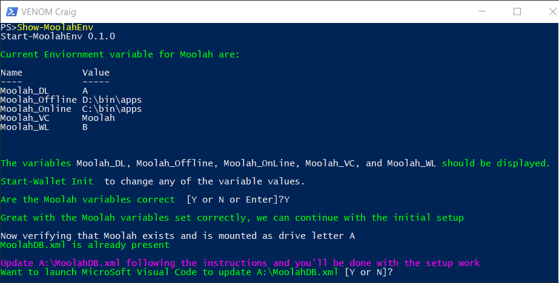
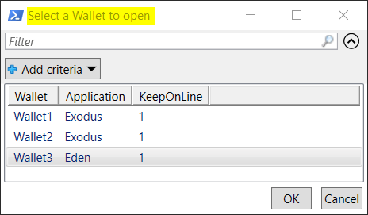
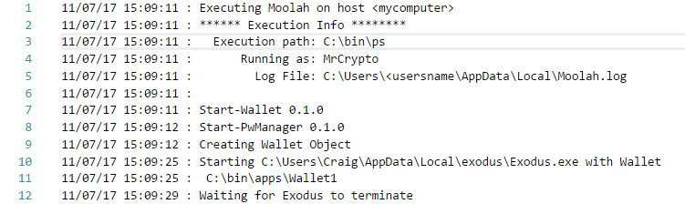

# Moolah Initialization

At this point all of the integration software has been installed and configured to support the **Moolah** PowerShell module. Now the **Moolah** module needs to be initialized to know about all of the needed integration details and the MoolahDB records need be modified according to your configuration.

## Moolah User Variables

A set of user environmental variables will be set as shown in the table below.

Variable | Default | Description
-------- | ------- | -----------
Moolah_DL | A | The drive letter value to be used for the **Moolah** VeraCrypt container
Moolah_WL | B | The drive letter value to be used for the **Wallet** VeraCrypt container
Moolah_VC | Moolah | The name choosen for the **Moolah** VeraCrypt container
Moolah_OnLine | C:\bin\apps | The folder path were the **Online** VeraCrypt containers are located.
Moolah_OffLine | D:\bin\apps | The folder path were the **Offline** VeraCrypt containers are located.

## MoolahDB Overview

The MoolahDB is a set of wallet and application records contain in XML format in the file, **MoolahDB-[computername].xml**.  During the initialization process a sample **MoolahDB** will be copied to the **Moolah** VeraCrypt container and may need to be updated match your configuration.  Any ASCII editor can be used to maintain the **MoolahDB** file, but I recommend using Microsoft Visual Code (**VScode**) because is has built in support for XML data. If you followed my instructions, **VScode** is already installed and ready to be used.

Here is an example of the default **MoolahDB** that will be copied to your **Moolah** VeraCrypt container during the initialization process.

Highlighted in yellow are likely the only values that may need to be modify.

A **wallet record** is defined between the start tag **Wallet** and the end tag **/Wallet**. The **Name=Wallet1** attribute on line 2 is the VeraCrypt container name for the wallet and the **Application=Exodus** attribute points to the **Application record** that maintains the wallet. So in this example it points to the application record defined starting a line 10.

The **KeepOnLine** sub tag/field (line 3) of the wallet record determines if the wallet VeraCrypt container is removed or maintained in the Online folder after the Exodus application is terminated.  A value of 1 keeps the wallet VeraCrypt container in the OnLine folder anyother value removes it.

An **application record** is defined between the start tag **Application** and the end tag **Application**. At line 10 is the start of the application record for **Exodus** and the record definition ends at line 14.  Each application record have three sub tags/fields defined **Binary, Process, and ARG**.

TAG | Description
--- | -----------
Binary | The executable binary name of the application.
Process | The process name of the application as seen in Task Manager.
ARG | Argument values that need to be passed to that application when started.

If the application can not be found by Windows 10, then the full path information needs to be included in the **Binary** tags or the system **Path** variable needs to updated to include the application's binary path location.

For instance, my PwManager application **Binary** is:

    <Binary>D:\bin\PasswordSafe\Pwsafe.exe</Binary>

Any number of wallet records and associated wallet application records can be defined in the **MoolanDB**.

**IMPORTANT THINGS TO REMEMBER AMOUT XML**

XML is case sensitive for all non-data values.  The values of the attributes and the value inbetween the start and end tag are NOT case sensitive.  The following start and end tag example would be an **error** because the start end and end tag do **NOT** match.

    <Binary>some data</binary>

If you just copy an existing record to create a new record, you won't a have worry about this.

## Moolan Initialization

Finally, the very last thing that needs to be done is to open a PowerShell console and execute the following cmdlet:

    PS> Start-Wallet Init

This will mount the **Moolah** VeraCrypt container prompt you for the password and launch the Password Manager application will also prompt you for the password.

In the PowerShell console, you'll be asked to set the values for the User environmental variables.

Now as instructed press the 'enter' key to end the current PowerShell session and  start a new PowerShell console window and enter the cmdlet:

    PS> Show-MoolahEnv

If you answered 'Y' or 'Yes' that the variables are correct, you are then asked if you would like to start **VScode** to update the **MoolahDB**. You'll want to answer 'Y' or 'Yes'
if have **VScode** installed. Update the **Moolah** to match your configuration as documented above.

Once **A:\MoolahDB-[computername].xml** has been updated correctly to reflect your setup you can launch the **Exodus** application by entering in the PowerShell console:

    PS> Start-Wallet

Also, you can launch **Exodus** by double-clicking on the **Moolah shortcut** icon on the desktop.

Neither of these methods for starting **Exodus** specified a specific wallet, so you will be prompted to select a wallet to use.

Select the wallet you want to open and click on the **OK** button.

If you want to start a specific wallet each time without being prompted with the Selection dialog. The enter the following command in the PowerShell console.

    PS> Start-Wallet Wallet3

You can modified the **Moolah shortcut** too to start a specific wallet too.

Lastly, **Moolah.log** is created and maintains a log of activities and the log is located in the folder:

    C:\Users\<username>\AppData\Local\Moolah.log

The log is rolled over every 1000 lines and a new log is started.  The old log will be in the same folder, but will have timestamp value added to it's name.
