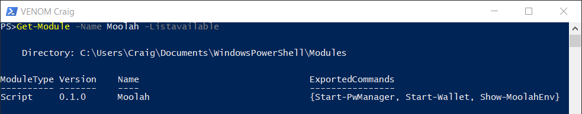

# Moolah Installation

At this point in the process, you should have all of the integrated software components installed and setup.  Additionally, you have taken the time to explore each of the software components. The reason this is important is because the **Moolah** module just integrates these software components to provide its solution.

## Start PowerShell Console

From either the PowerShell desktop icon or the task bar click on the PowerShell Icon.  Once the PowerShell console is presented type in the following command.

    PS> Set-PSRepository -Name "PSGallery" -installationPolicy Trusted

The **Moolah** module will be downloaded from Microsoft's PSGallery and this command is telling PowerShell that we trust the repository **PSGallery**.

Your PowerShell prompt may be different than **PS>**.  If you would rather just use the **PS>** prompt rather than the default prompt enter this command.

    PS> function prompt {$null}

## Install Moolah Module

There are basically two ways to install the **Moolah** module.  For those not that familiar with PowerShell or Windows, the easiest is to use the **Install-Module** command. The other method is to copy the correct components from GitHub to the appropriate directory on your computer.  We will be using the **Install-Module** method.

    PS> Install-Module -Name Moolah -Scope currentuser

If the PowerShellGet module is not already installed, there will be a prompt requesting permission to install the module. A selection of 'Yes' is the right answer.

If the **Moolah** module has already been installed, it can be updated to the latest version by entering the command:

    PS> Update-Module Moolah

## Verify Moolah Installation

If the **Install-Module** executed without any errors, then the enter the following command.

    PS> Get-Module -Name Moolah -ListAvailable

The output should appear similar to the following output.

From the output we see that the **Moolah** module implements three cmdlets named, **Start-Wallet**, **Start-PwManager**, and **Show-MoolahEnv**.

With the **Moolah** module installed, you are now ready to move to the next step of setting up the module and the integrated software for your computer.