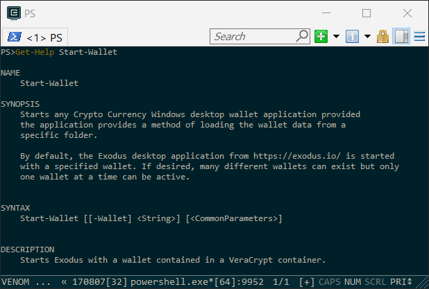

# Moolah Cmdlets

The **Moolah** module currently consists of these cmdlets:

cmdlet | Version | Description
------ | ------- | -----------
Get-CryptoTicker | 0.1.6 | Starts the Ticker application display asset ROI.
Start-GnuCash | 0.1.5 | Starts the **GnuCash** Financial Accounting application
Start-Wallet | 0.1.5 | Starts the **Exodus** wallet application using the current configuration and start the Password Manager application.
Start-PwManager | 0.1.0 | Starts the Password Manager application
Show-MoolahEnv | 0.1.0 | Show the current Moolah User environmental variables and optionally start VScode to manage the **MoolahDB**

 Alternatively, the **Start-Wallet** cmdlet can be started by double-clicking on the **Moolah Shortcut** on the desktop.

Help for each cmdlet is available by entering the following command:

    PS> Get-Help Start-Wallet -full

**WHAT!!** This doesn't look like the normal PowerShell console window that has been displayed. Well it is the PowerShell console but it is being emulated by a software product called [ConEMU](https://conemu.github.io/).  If you live in the shell world a lot like I do, I **highly** recommend you evaluate it for yourself.