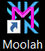
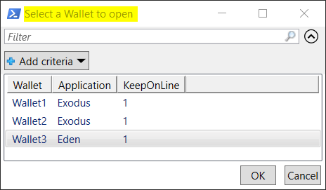

# Moolah

Moolah is a slang term for money and also a Powershell module consisting of other PoweShell cmdlets used for protecting your crypto currency and other financial automation.S

**The Moolah module will NOT save you from yourself.**

If you forget the passwords to the VeraCrypt containers, Password Manager or delete the VeraCrypt containers and do not have a backup, kiss your crypto currency good-bye.

I personally use the **Moolah** module to add extra protection and mobility for my crypto currency data.  Another strong benefit is that it simiplifies the process to the degree where my wife will be able launch the wallet applications should I graduate from life sooner than expected.

If you decide to use the **Moolah** module, **you do so at your own risk**.

***

Rather diving into how to install and configure all the software components that are integrated with the **Exodus** wallets, a functional overview is presented first so you can decide whether or not this is a solution that you would like to implement.

The functionality implemented in the **Moolah** module is intended to supplement the protection mechanism provided by the **Exodus** wallet applications and **NOT** replace it.

Once all of the software is installed and configured, the **Exodus** wallet and **PasswordSafe** are started by double-clicking on the **Moolah** icon on the desktop or single clicking on the icon on the task bar.

The other option for launching the **Exodus** wallet and **PasswordSafe** using the **Moolah** module is to execute the **Start-Wallet** cmdlet in the PowerShell console window.

After executing the **Start-Wallet** cmdlet, the following output will appear in the PowerShell console.

Reviewing the PowerShell console output the top to lines are show that both the **Start-Wallet** and **Start-PwManager** application have been started. **Subversion** (SVN) is optionally supported too and the **TortioseSVN** client is used for **SVN** commits and updates.

If a wallet name is not provided with the **Start-Wallet** cmdlet, the following **Wallet Selection** dialog will be presented.

Select the desired wallet to open and click on the **"OK"** button.

The password dialog prompts for the VeraCrypt containers and PasswordSafe are **NOT** shown here.

The final end result is the **Exodus** wallet GUI will appear on the desktop and looking at the last line in the PowerShell console out you can see the **Start-Wallet** cmdlet is waiting for the **Exodus** application to be terminated.

The workflow executed prior to the **Exodus** GUI appearing happens in the following sequence.

  1. **Start-Wallet** cmdlet is executed.
  2. **Start-PwManager** cmdlet is executed.
  3. The Moolah VeraCrypt container is mounted on drive A:.        **Waiting for A:...**
  4. SVN update is performed on the Moolah VeraCrypt container.    **Performing SVN update...**
  5. The Exodus wallet VeraCrypt container is mounted on drive B:. **Waiting for B:...**
  6. SVN update is performed on the Wallet VeraCrypt container.    **Performing SVN update...**

After quiting the **Exodus** wallet application, the following output will appear in the PowerShell console.

  1. SVN commit is performed via TortoiseSVN on the Wallet VeraCrypt container drive B:\.  **Performing SVN commit...**
  2. Wallet VeraCrypt container is unmounted from drive B:.  **Unmounting B:...**
  3. Online Wallet container is backed-up to Offline media.  **Updating offline copy...**
  4. Password Manager application is terminated.  **Shutting down PW Manager...**
  5. SVN commit is performed via TortoiseSVN on the Moolah VeraCrypt container drive A:\. **Performing SVN commit...**
  6. Moolah VeraCrypt container is unmounted for drive A:.  **Unmounting A:...**
  7. Online Moolah container is backed-up to the Offline media.  **Updating offline copy...**

The above sequence implements all of the requirements that I set out to achieve.

  1. To have the Exodus application and the wallet data available on any Windows 10 computer at anytime on the home network.
  2. To have a hardware wallet functionality without purchasing a hardware wallet. (a.k.a SW Hardware wallet)
  3. To have the Exodus application, wallet data, and integrated software restorable from offline media to any Windows 10 computer.
  4. To have the ability to have multiple wallets.
  5. The process needs to be easy enough to implement that even a non-technical person can operate and implement the solution.

This solution is flexible enough to support any crypto wallet application or password manager application provided the application's
data can be redirected to any directory location on your computer.  Any of the drive letters or directory locations used for the VeraCrypt
containers are totally customizable.

This is a very quick and short overview of the **Moolah** module capabilities.  If you care to implement this on your computer keep reading the documentation in sequence, otherwise there is no need to continue reading.