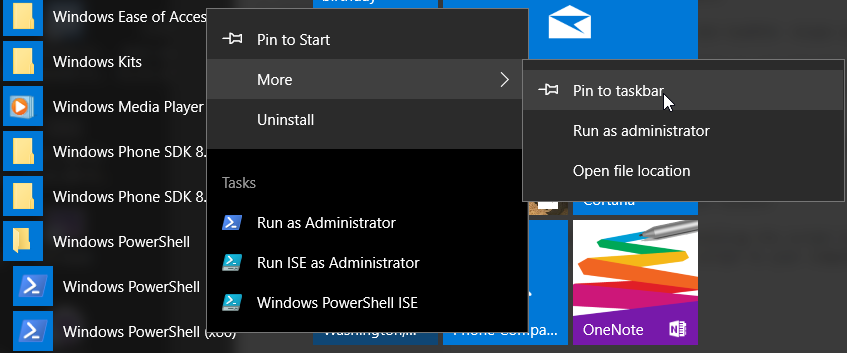
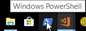
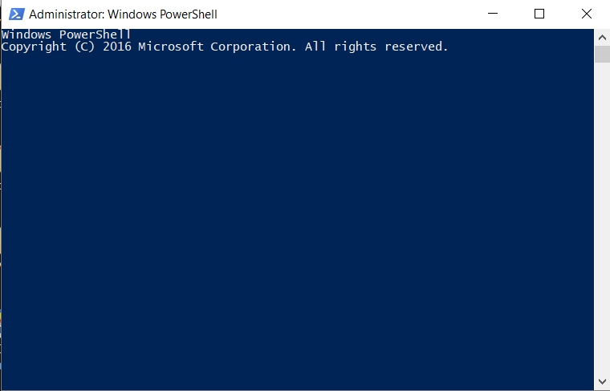
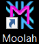

# PowerShell Overview

Now that you have had a brief review of the **Moolah** module and **Start-PwManager** cmdlet, I'm assuming you are willing to take the time and effort setup your environment to enable these cmdlets.  The only time you need work work from the PowerShell console is during the initial setup of the module. There after the PowerShell console is started automatically for you.

**PowerShell** is a command line interface that was originally only available on the Windows operating system.  With **.Net Core** being actively developed, **PowerShell** is now available on MacOS and Unix operating systems, but not with the full functionality available on the Windows OS.

People having a technical responibility for maintaining computer systems are very familiar with the various the command line interfaces available on different operatings systems. I'm assuming you don't have a technical background using the command line interfaces.  The term 'Shell' is often used to generically refer to a command line interface.  The primary benefit of using a shell is that repeative work can be accomplished very quickly and consistently.

The goal here is to provide you with the needed information to get **PowerShell** enabled and working on your Windows 10 operating system. You don't need to master PowerShell in order to accomplish this work because the module does the work for you.

## PowerShell Console setup

With newer versions of Windows operating systems, PowerShell is installed by default but not likely enabled.

For a more indepth information on [Installing PowerShell](https://docs.microsoft.com/en-us/powershell/scripting/setup/installing-windows-powershell?view=powershell-5.1) click this link.

On Windows 10, **PowerShell** is installed by default, but the execution policy needs to be set to **unrestricted** which requires lanuching PowerShell console in administrative mode.

After finding PowerShell in the Windows PowerShell folder in the start menu, select the option **Pin to taskbar**.  This will pin the **PowerShell** icon to your taskbar which makes it easier to launch the PowerShell console window.

Your taskbar should now contain the PowerShell icon used to launch the PowerShell console window.

From the TaskBar, right-click on the PowerShell icon and select **Run As Administrator**.

The PowerShell Console title bar shows the value **Administrator**.  This indicates that PowerShell is running in adminstrator mode.

In the PowerShell console window, enter the following command.

    PS> set-executionpolicy -unrestricted

**Enter the command 'exit' to quit the console window**

There is not any reason to run PowerShell in administrative to complete the remaining setup.

Start the PowerShell Console again and verify the installed version of PowerShell.  Enter the following command.

    PS> $PSVersionTable

You'll need to running PowerShell version 5 or newer. The module was tested with the following code levels.

    PS> $PSVersionTable

    Name                           Value
    ----                           -----
    PSVersion                      5.1.15063.413
    PSEdition                      Desktop
    PSCompatibleVersions           {1.0, 2.0, 3.0, 4.0...}
    BuildVersion                   10.0.15063.413
    CLRVersion                     4.0.30319.42000
    WSManStackVersion              3.0  
    PSRemotingProtocolVersion      2.3
    SerializationVersion           1.1.0.1

***
If you are running an older version of PowerShell, following the above link to upgrade to the 5.x version of PowerShell.  Please note that version 6.x is the **.Net Core** version and you
do **NOT** want this version.

Once PowerShell has been setup and the **Moolah** installed, the **Start-Wallet** and **Start-PwManager** cmdlets will be started automatically by double clicking on the **Moolah** desktop icon which will be created during the upcoming setup process.

After double clicking on the **Moolah** desktop icon, the following **Moolah** cmdlets are executed automatically for you.

    PS> Start-Wallet

    PS> Start-PwManager

At this point, you should be able to launch the PowerShell Console window and close the PowerShell console window by entering the **exit** command.