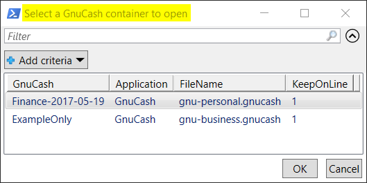
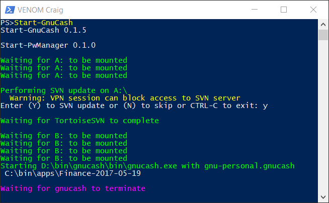

# Start-GnuCash Cmdlet

The **GnuCash** Financial Accounting software can be downloaded from [Download GnuCash](https://gnucash.org).

If you are installing the **Moolah** module for the first time, you'll need to follow the full instructions for setting up the
module. If this has not been done, **then go back to the beginning and read all of the instructions from start to end**.

The **GnuCash** database will need to be moved to a VeraCrypt container. The VeraCrypt container will be mounted
as drive letter B by default but depends on how the **Moolah** module was initialized. Click on this URL to find the location
of the **GnuCash** database [Locate GnuCash DB](https://wiki.gnucash.org/wiki/FAQ#Q:_Where_is_my_GnuCash_data_file.3F).

Copy the full contents of the **GnuCash** database to the newly created VeraCrypt container.  I would **HIGHLY** recommend
recording your VeraCrypt container password in the Password Manager application.  If you forget your password or delete the VeraCrypt
container then you have lost your data.  The **Moolah** module will keep both an Online and Offline (**multiple copies recommended**) version of
the VeraCrypt container, so the Online version can always be recovered from the Offline copy.  With a little extra work, **Subversion** in supported
for synchronizing the VeraCrypt container across multiple computers.

Next, two records in the **Moolah DB** file, *MoolahDB-[computername].xml* need to be updated to match your configuration.

    <GnuCash Name="ExampleOnly" Application="GnuCash">
      <FileName>gnu-business.gnucash</FileName>
      <KeepOnLine>1</KeepOnLine>
      <Alert>0</Alert>
    </GnuCash>
    <Application Name="GnuCash">
        <Binary>D:\bin\gnucash\bin\gnucash.exe</Binary>
        <Process>gnucash</Process>
        <ARG></ARG>
    </Application>

In the GnuCash DB record, the value **Name="ExampleOnly"** change the **ExampleOnly** part to match your desired name of the **GnuCash DB**.  Multiple GnuCash
records can exist to support having multiple accounting databases.  Next, change **gnu-business.gnucash** to match the filename of your **GnuCash DB**.  A value of *1* in the **KeepOnLine** tag will keep the VeraCrypt container in the Online folder. Any other value, will cause the VeraCrypt container to be automatically removed after backing up the VeraCrypt container to the Offline folder.  The **Alert** tag is not implemented at this time.

In the GnuCash Application record, the value **D:\bin\gnucash\bin\gnucash.exe** needs to be changed to match your installed location.

With configuration setup completed, the **GnuCash** application can now be started by entering the following command in the PowerShell console.

    PS> Start-GnuCash

If a specific **GnuCash** account name is not provided as in the example above, then a selection dialog will be presented.

 Select a row and click on the **OK** button.

After a selection is made, the following output will appear in the PowerShell console and the **GnuCash** GUI will be presented.

In the above output example, the **Subversion** feature is implemented so your are seeing prompts for updating the current copy. Once
the **GnuCash** GUI is terminated, there will be prompts for performing **SVN** commits prior to dismounting the VeraCrypt drives.