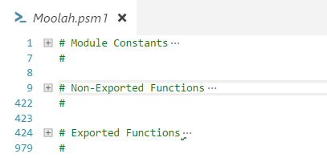

# Support

It is always helpful to get constructive feedback about the positive and negative stuff with the software.  At this time there is not a tool like a **Slack** channel dedicated to **Moolah**, but you can always open an issue in GitHub or send me an email via PSGallery.

If your are a **PowerShell coder**, you can always fork off a version of **Moolah** make enhancements and submit pull requests.

Donations are always a welcome way of showing your graditude.  I gladly accept crypto currency or $USD via **PayPal** see the donatation page if you are wanting to show your graditude this way.

***
## Code Structure

I don't have any hard and fast rules or ethics about making code contributions. But, you should follow how the code is currently structured, I won't be reformatting your work for you.  You may have a different style, but I've been programming since 1981 and my habits (good or bad) are hard to break, but I'm not hard head enough to not consider doing things a better way either.

The code structure of the **Moolah** module (spacing, indentation and etc... ) is influenced on how Visual Studio Code does code folding.  The code folding feature in **VScode** is something I try to leverage has much as possible.  When opening the module in **VScode**, my first command is always **'Ctrl+K+0'**. This will colapse the 979 lines of the **Moolah** module code so it can be displayed on a single page.

***